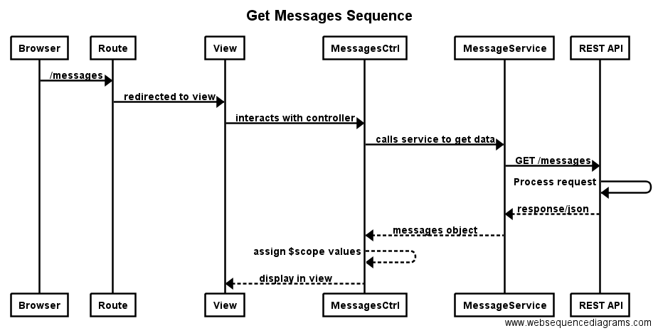
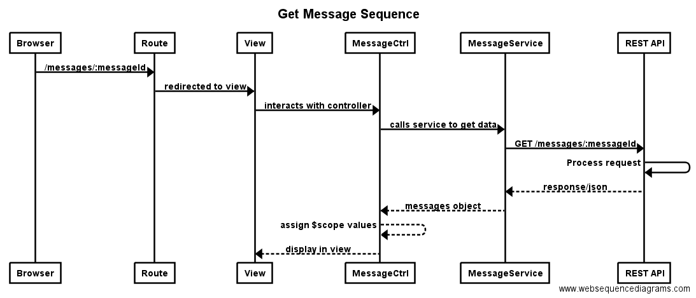
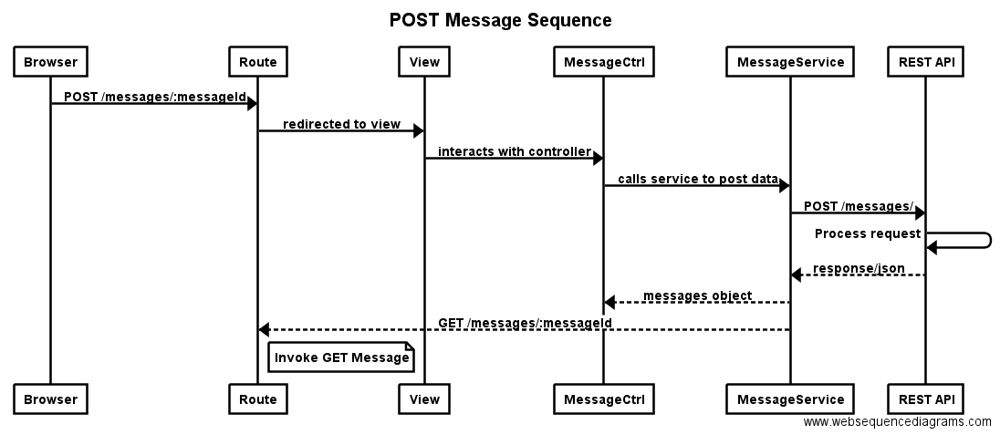

# Palindrome - REST Api with a front-end UI to submit messages and verify if they are palindromes

## Getting started

### Prerequisites
You will need to have node installed and docker as well if you choose to run this in a docker container.

### Getting the source
```
git clone https://github.com/dotLou/palindrome.git
```
## Docker
### 1. Docker build
```
docker build . -t dotlou/palindrome
```
### 2. Docker deployment
```
docker run -d -it dotlou/palindrome -e "MONGO_URL='mongodb://your_connection_info'"
```
This will run the server with the default port of 3000.

## Development Environment
## 1. Install packages
```
npm install
```
## 2. Mongo
This app assumes you have a mongo endpoint with a connection url defined at MONGO_URL. You should export this ahead of running it.
## 3. (Optional) Seed the database with some initial data
```
npm run dbseed
```
### 4. Launch the webserver
To server at the default 3000 port:
```
npm start
```

### CSS autoprefixer
There is a gulp task (set as default) to generate CSS prefixes so you don't need to worry about it. With this in mind, make all CSS changes to root/styles/\*.css and *_NOT_* to public/css/.
Once changes have been completed, run the following command to "compile" them with the prefixes:
```
gulp
```

## API definition
The full API definition is available at http://server:3000/apidoc

### Generating a fresh copy of the api documentation
The full API documentation gets generated for all definitions inside the routes/ folder. You can re-generate the docs like this:
```
npm run apidoc
```
This will generate the full docs into public/apidoc and thus make it available via http://server:3000/apidoc

## Testing
This project comes with tests for both the backend (node) and frontend (angular).

### Running backend (node) tests
```
mocha
```
### Running frontend (angular) tests
```
gulp test
```

## Sequence Diagrams
### GET Messages

### GET Messages

### POST Messages

## License
The MIT License (MIT)

Copyright (c) 2016 Louis Cloutier

Permission is hereby granted, free of charge, to any person obtaining a copy
of this software and associated documentation files (the "Software"), to deal
in the Software without restriction, including without limitation the rights
to use, copy, modify, merge, publish, distribute, sublicense, and/or sell
copies of the Software, and to permit persons to whom the Software is
furnished to do so, subject to the following conditions:

The above copyright notice and this permission notice shall be included in all
copies or substantial portions of the Software.

THE SOFTWARE IS PROVIDED "AS IS", WITHOUT WARRANTY OF ANY KIND, EXPRESS OR
IMPLIED, INCLUDING BUT NOT LIMITED TO THE WARRANTIES OF MERCHANTABILITY,
FITNESS FOR A PARTICULAR PURPOSE AND NONINFRINGEMENT. IN NO EVENT SHALL THE
AUTHORS OR COPYRIGHT HOLDERS BE LIABLE FOR ANY CLAIM, DAMAGES OR OTHER
LIABILITY, WHETHER IN AN ACTION OF CONTRACT, TORT OR OTHERWISE, ARISING FROM,
OUT OF OR IN CONNECTION WITH THE SOFTWARE OR THE USE OR OTHER DEALINGS IN THE
SOFTWARE.